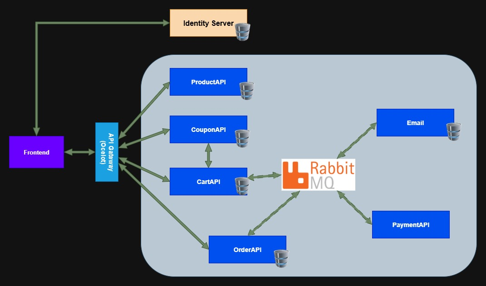

# GeekShopping Microservices

This project represent an eShop for geeks. Was created to trainning microservices knowledges, based on [Leandro Costa Repository](https://github.com/leandrocgsi/erudio-microservices-dotnet6)



## How to execute application?

```bash
# Build each service docker image
docker build -f docker/product-api.dockerfile -t product-api .
docker build -f docker/cart-api.dockerfile -t cart-api .
docker build -f docker/coupon-api.dockerfile -t coupon-api .
docker build -f docker/order-api.dockerfile -t order-api .
docker build -f docker/frontend.dockerfile -t frontend .

# Run docker compose
docker compose up
```


## ProductAPI

- To manage products database

## CartAPI - Working Progress

## CouponAPI - Working Progress

## OrderAPI - Working Progress

## PaymentAPI - Working Progress

## Email - Working Progress

## Identity Server - Working Progress

## API Gateway - Working Progress